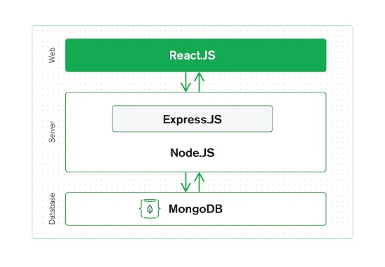

# Report on 'Web Medical Management System'

Course : MSDS  
Batch : C2  

Girish Nair  
April 2023

---
## ABSTRACT  

Health care of high quality is a benchmark for good standard of life. But its not available to everyone at all times, either due to distance from health care centers or situations like covid pandemic or busy specialist.  

What if there is an online platform which can help them communicate and resolve this issue, thus improving quality of health care delivery to more people and those in great needs.

The report looks at the development of a "Medical Web-app" that provides 'telemedicine' over the internet. This web-app will allow doctors to provide medical assistance to patients remotely, without the patients having to visit the health care center unless it is unavoidably important like for invasive tests, deeper diagnosis and surgery.

---
## BACKGROUND

Advancement in health sciences and medicine is a boon to patients. But not all are benefited due to lack of easy access.

Also the recent pandemic has limited patients movement and made even regular visits to the hospitals extremely difficult.  

But technological innovations has provided hope to alleviate these problems, by means of 'telemedicine' which tries to provide medical services to patients via the internet. So patients can consult their doctors online via video conferencing. They can also get e-prescription's and health reports online and reduce their travel to hospitals considerably.

---
## PROBLEM STATEMENT

Availability and accessibility of health care to those in need is critical, else health issues gets neglected. 

Covid-19 pandemic has highlighted this when even the most vulnerable needing quick medical attention were not able to get it.  This is the crux of the problem that needs addressing. 

There are many new technologies that can be employed to resolve this issue. What we need is a simple, effective and reliable solution.

---
## RESEARCH QUESTIONS

Is it possible to offer health services through online channel, so that patients can minimize their visits to the hospital by getting many of the services online like booking appointment with the doctor, accessing prescriptions and test reports etc.  

According to healthcare experts, 75% of the hospital visits are very basic and can be easily managed via phone call or video conferencing. 

How to offer patients a seamless web experience to manage their health remotely.

---
## AIM AND OBJECTIVES

Create a "Web Application" providing telemedicine platform using telecommunications over the internet for patients to access healthcare services remotely.

The primary goal is to make doctor-patient interaction virtual, reducing doctors’ workload, and speeding up patient consultations.
So develop a web-app, that has following features : 
- Provide high quality and easily accessible healthcare services.
- Simplify doctor-patient interaction for consultation, diagnosis, monitoring and prescriptions.
- Make e-prescriptions and reports available for patients
- Streamline administrative processes.
- Reduce overall healthcare costs for all parties.
- Evaluate the operational efficiency, effectiveness and reliability of the system.

---
## SIGNIFICANCE OF THE STUDY

Doctors can get to service more remote patients. They can also network with other doctors/experts more easily than before and keep themselves updated.

Patients can get access to health care without visiting a health care center. They can get an e-prescription, access their health reports and even make payments through the 'web-app'.

Hospitals can better utilize their resources in providing high quality care. There will be less foot-falls as all non-critical functions gets done online. Hospital staff can now switch to more productive work.

---
## SCOPE OF THE STUDY

This study is about the development of a 'web-app' providing 'telemedicine platform' as a kind of 'virtual health care centre' where doctors and patients can meet online and resolve health issues. 

Doctors can after diagnosis prescribe medications or treatment which can be saved online as e-prescriptions. 

Other services like health reports and patient health records can also be saved online.

The services rendered can also be paid online by integrating 3rd party apps and payment gateways. 

---
## RESEARCH METHODOLOGY

Primary task is to get the doctors and hospital staff to identify all functional requirements for the 'web platform'.

Next create a solution prototype that everybody agrees.  
It should take care of all technical and non-technical aspects.

The project is developed using the MERN stack (MongoDB, Express.js, React.js and Node.js. 
- MERN provides a very pleasing and responsive UI, and is great for data-driven applications. 
- MERN is more cost effective, offers better speed and user experience as compared to others like MEAN or MEVN.

Design Consideration includes :  
- Incorporating Security features like : End-to-end data encryption (SSL and AES-256), MFA, max login retries.
- Compliance with privacy and security, enforcement, and breach notification rules like : HIPAA (US), GDPR (European), NIST (US), IT Act 2000, TCCP Regulations 2010.

---
## WEB APP build with MERN Stack 

MERN Stack stands for MongoDB, Express, React, Node.js

**MongoDB** - is a document-oriented database program based on NoSQL.  
**Express** - is a robust Node.js web application framework that helps in creating powerful REST APIs.  
**React** - is a JavaScript library used to create beautiful and interactive user interfaces developed by Facebook and the community of individual developers.  
**Node** - is a JavaScript runtime environment built on Google Chrome’s V8 engine, and compiles `js` at runtime.

---
#### Broad dev steps involve 
- Create React Application
- Create React Components
- Implementing React Router
- Build Node JS Backend
- Setting up MongoDB Atlas Database
- Define Mongoose Schema
- Create Routes Express
- Configure Server File

---
#### About the 'WEB APP'

The proposed 'Virtual Health Care' web app helps patients to meet their doctors from their homes. They can primarily book an appointment starting from the next day and within a fortnight (14 days). The doctor 'approves' it before the day ends, else suggests the patient to reschedule. 

The doctor generates a zoom call link 15 mins prior to the scheduled appointment time, and updates the 'Patient Call Link'. The patient uses that link to connect with the doctor.

The doctor examines the patient through the 'video call' and prescribes medications and further course of action.

---
#### MAJOR USER ROLES are : 'Doctor', 'Patient'

Their broad journey involves :

PATIENT's JOURNEY : 
- 01/12  SignIn with email & password.    30
- 02/12  SignUp if not already registered.   28
- 03/12  Checks own profile.    37
- 04/12  Edits it if needed.    38
- 05/12  Checks appointment list.   31
- 06/12  Checks doctors profile.    32
- 07/12  Changes the appointment date-time if needed.    33
- 08/12  Checks for available doctors.    34
- 09/12  Books an appointment.    35, 39
- 10/12  Cancels the appointment by setting 'Patient Cancel' as Yes.    39
- 11/12  Makes a zoom call with the 'Patient Call Link' at the scheduled time.   39
- 12/12  Follows doctors advice.  🙏

DOCTOR's JOURNEY : 
- 01/13  SignIn with email & password.  18
- 02/13  SignUp if not already registered.  19
- 03/13  Checks appointment list.   21
- 04/13  Checks patient profile.  23
- 05/13  Approves 'pending' appointments.  24
- 06/13  Checks own profile.    25
- 07/13  Edits it if needed.   27
- 08/13  Creates a Zoom link 15 mins prior to meeting, and updates the 'Patient Call Link'.  21
- 09/13  Lets in the patient at the scheduled meeting time  
- 10/13  During the call, doctor adds the 'Prescription'.  21
- 11/13  Doctor then marks the status as 'completed'.  21
- 12/13  If the appointment is not successful, the status is marked as 'cancelled'.  21
- 13/13  Irrelavant appointments are deleted by the doctor.  21

Note: 
- Doctor can edit only 'Status', 'Patient Call Link' and 'Prescription' of an individual appointment.
- Patients can edit only 'Date' and 'Patient Cancel'  of an individual appointment.

---
#### Database Structure

Appointment collection have fields as:  

Field | Data Type | Options
---|---|---
Status | String | Pending/Approved/Completed/Cancelled 
Date | date | 
Doctor | String 
Patient | String 
Patient_Call | String | Link 
Perscription | String 
Patient_Cancel | String | Y/N 

Doctors Profile collection have fields as:  

Field | Data Type | Options
---|---|---
Name | String 
Age | String
Gender | String | Male/Female
Speciality | String 
Active | String | Y/N 
Email | String 
Password | password

Patients Profile collection have fields as:  

Field | Data Type | Options
---|---|---
Name | String 
Age | String
Gender | String | Male/Female
Address | String 
Mobile | String 
Email | String 
Password | password

---
## REQUIREMENTS RESOURCES

**Hardware**  
OS : Windows
Storage : 40 GB  
RAM : 4 GB  
Processor : 2 GHz, P4

**Software**  
Front-end : React.js  
Back-end : Node.js, Express.js  
Database : MongoDB Atlas  

---
## RESEARCH PLAN

The steps needed to create an 'Online Medical Telemedicine Web-app' are:  
- Define the problem that the health care professionals (doctors, staff and admins) are facing.
- Get an accurate account of their process flow.
- Note the data and web platform requirements.
- Produce a solution prototype, and get everybody's consent.
- Decide on the tech-stack as per the clients requirements, budget and regulatory framework.
- Develop the software and test it rigorously.
- Get the clients approval and implement the solution.
- Monitor & maintain the solution.
- Update the solution regularly.

---
## REFERENCES
- Writing for computer Science by Justin Zobel
- Telemedicine : The Indian perspective [🔗](https://nmji.in/telemedicine-and-virtual-consultation-the-indian-perspective/)
- Deloitte : The future of virtual health [🔗](https://www2.deloitte.com/us/en/insights/industry/health-care/future-of-virtual-health.html)
- Telemedicine: A Blessing In Disguise [🔗](https://www.niti.gov.in/telemedicine-blessing-disguise)
- Use of Telemedicine and Virtual Care for Remote Treatment [🔗](https://link.springer.com/article/10.1007/s10916-020-01596-5)  
- How To Use MERN Stack: A Complete Guide | MongoDB [🔗](https://www.mongodb.com/languages/mern-stack-tutorial)
- Getting Started with MongoDB & Mongoose | MongoDB [🔗](https://www.mongodb.com/developer/languages/javascript/getting-started-with-mongodb-and-mongoose)
- Mongoose v7.0.5: Getting Started [🔗](https://mongoosejs.com/docs/index.html)
- Express Tutorial Part 3: Using a Database (with Mongoose)  [🔗](https://developer.mozilla.org/en-US/docs/Learn/Server-side/Express_Nodejs/mongoose)

---
## APPENDIX

- Code : [for Medical Web App](https://github.com/gircodes/med-web-app)  
- Demo : [on Render.com](https://github.com/gircodes/med-web-app/blob/main/report/demo.md)

---
